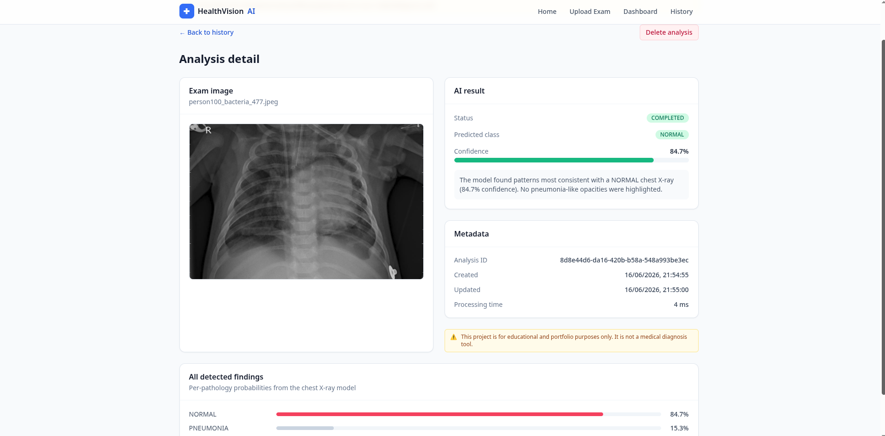

<div align="center">

# 🩻 HealthVision AI

### AI-assisted chest X-ray analysis, engineered like production software.

Full-stack **HealthTech** demo: upload a chest X-ray → an **asynchronous AI
pipeline** classifies it (`NORMAL` / `PNEUMONIA` / `UNCERTAIN`) with a confidence
score, plain-language explanation, full per-pathology findings, a dashboard and
history.

[](.github/workflows/ci.yml)
[](backend)
[](backend)
[](frontend)
[](frontend)
[](docs/ai-model.md)
[](docker-compose.yml)
[](LICENSE)

**Architecture:** Clean + Hexagonal + light DDD · **Async:** Celery + RabbitMQ ·
**Tests:** Pytest · Vitest · Playwright

🇧🇷 [**Versão em português**](README.pt-BR.md) · 🇺🇸 English (you are here)

</div>

> ⚠️ **Disclaimer:** This project is for **educational and portfolio purposes
> only. It is not a medical diagnosis tool.** Do not use it for clinical
> decisions.

---

## Table of contents

- [Project overview](#project-overview)
- [Problem solved & why this project exists](#problem-solved--why-this-project-exists)
- [Tech stack](#tech-stack)
- [Features](#features)
- [Architecture](#architecture)
- [AI pipeline](#ai-pipeline)
- [Data flow](#data-flow)
- [API endpoints](#api-endpoints)
- [How to run locally](#how-to-run-locally)
- [Tests](#tests)
- [CI/CD](#cicd)
- [AWS cloud-ready architecture](#aws-cloud-ready-architecture)
- [Future improvements](#future-improvements)
- [Disclaimer](#disclaimer)

---

## Project overview
A user uploads a chest X-ray image. The API validates it, stores it, creates an
`Analysis` record with status `PENDING`, and dispatches an async task to a
**Celery** worker via **RabbitMQ**. The worker runs the AI pipeline (image
preprocessing → model inference), persists the result, and the frontend polls
until the analysis is `COMPLETED`. Results feed a dashboard with charts and a
filterable history.

The point of the project is **engineering maturity**, not medical accuracy: it
showcases Clean/Hexagonal architecture, DDD-lite, async processing, typed
contracts end-to-end, tests, Docker and CI/CD.

## Problem solved & why this project exists

Real HealthTech products share a recurring shape: ingest medical artifacts,
process them asynchronously with ML, persist auditable results, and surface them
through dashboards — all while keeping ML, infrastructure and business rules
decoupled and testable.

This repository is a compact, honest reproduction of that shape, designed to:

- demonstrate **production-grade backend architecture** (Clean + Hexagonal + DDD-lite);
- demonstrate a **modular, feature-sliced React frontend**;
- show a **real async ML pipeline** that can swap a mock model for a real one
  with zero changes to business logic;
- be **fully runnable** with a single `make up`.

## Tech stack

| Layer       | Technologies |
|-------------|--------------|
| Backend     | Python 3.11, FastAPI, SQLAlchemy (async), PostgreSQL, Alembic, Celery, RabbitMQ |
| AI / data   | PyTorch-ready predictor, OpenCV, Pillow, NumPy, Pandas, scikit-learn |
| Frontend    | React 18, TypeScript, Vite, React Query, Zustand, React Router, TailwindCSS, Recharts |
| Testing     | Pytest, Vitest, Testing Library, Playwright |
| DevOps      | Docker, Docker Compose, GitHub Actions, Makefile |

## Features

1. **Home** — project explanation, educational disclaimer, CTA, tech summary.
2. **Upload** — drag & drop, client + server validation (type/size), live preview,
   creates a `PENDING` analysis.
3. **Async processing** — FastAPI saves the image + DB record, enqueues a Celery
   task; the worker runs inference and saves the result.
4. **AI** — a deterministic **mock engine** by default, with a drop-in
   **PyTorch** engine ready for real weights. Classes: `NORMAL`, `PNEUMONIA`,
   `UNCERTAIN`.
5. **Result** — status, predicted class, confidence, processing time, explanation,
   educational warning.
6. **Dashboard** — totals, by-class & by-status breakdowns, average confidence,
   distribution chart, recent analyses.
7. **History** — list with status/class filters, links to detail.
8. **Detail** — image, result, confidence bar, explanation, metadata, live status
   polling.

## Architecture

The backend follows **Clean Architecture + Hexagonal (Ports & Adapters) + light
DDD**. Dependencies always point inward; the domain knows nothing about FastAPI,
SQLAlchemy, Celery or PyTorch.

```
interfaces (FastAPI routes, schemas)      ← outermost adapter
        │ depends on
application (use cases, DTOs)
        │ depends on
domain (entities, value objects, services, PORTS)   ← innermost, pure
        ▲ implemented by
infrastructure (SQLAlchemy repo, AI engines, storage, Celery)  ← adapters
```

Key ports (`backend/app/domain/`):
`AnalysisRepository`, `FileStorage`, `AIInferenceService`. Each has a concrete
adapter in `infrastructure/`, and an in-memory fake in tests.

The frontend mirrors this with a **modular / feature-sliced** layout: each
feature (`exam-upload`, `dashboard`, `analysis-history`, `analysis-detail`,
`auth`) owns its `components/`, `hooks/`, `services/`, `types/`, `pages/`, with
cross-cutting building blocks in `shared/`.

Full write-up: **[docs/architecture.md](docs/architecture.md)**.

## AI pipeline

```
bytes → validate (Pillow) → preprocess (resize + normalize)
      → inference engine (torchxrayvision | custom weights | mock)
      → score → uncertainty gate → Prediction value object → persisted
```

- **Real model (default in Docker):** a **torchxrayvision DenseNet**
  (`densenet121-res224-all`) pretrained on large public chest X-ray datasets.
  It outputs per-pathology probabilities; we use `Pneumonia` / `Consolidation`
  / `Lung Opacity` to classify `NORMAL` / `PNEUMONIA` / `UNCERTAIN`.
- **Custom weights:** set `MODEL_WEIGHTS_PATH` to your own fine-tuned checkpoint.
- **Mock engine (fallback):** deterministic, torch-free — keeps the project
  runnable without the heavy ML stack (CI, quick clones). Force it with
  `USE_MOCK_INFERENCE=true`. It is *not* a classifier; it only exercises the
  pipeline. All three return the **same `Prediction` contract**.
- **Uncertainty gate:** ambiguous scores become `UNCERTAIN` rather than forcing
  a confident-but-wrong answer.

Details: **[docs/ai-model.md](docs/ai-model.md)**.

## Data flow

```
Browser ──upload──▶ FastAPI ──save img──▶ Storage (local / S3)
                       │
                       ├── insert Analysis(PENDING) ──▶ PostgreSQL
                       └── enqueue task ──▶ RabbitMQ ──▶ Celery worker
                                                            │
                                  preprocess + inference ◀──┘
                                            │
                                  update Analysis(COMPLETED) ──▶ PostgreSQL
Browser ◀──poll GET /analysis/{id}── FastAPI
```

## API endpoints

| Method | Path                         | Description                       |
|--------|------------------------------|-----------------------------------|
| GET    | `/health`                    | Liveness/readiness check          |
| POST   | `/api/v1/analysis/upload`    | Upload an image, create analysis  |
| GET    | `/api/v1/analysis`           | List analyses (filter status/class) |
| GET    | `/api/v1/analysis/{id}`      | Get a single analysis             |
| DELETE | `/api/v1/analysis/{id}`      | Delete an analysis and its image  |
| GET    | `/api/v1/dashboard/summary`  | Aggregated dashboard metrics      |

Interactive docs (Swagger UI) at `http://localhost:8000/docs`.

## How to run locally

### Option A — Docker Compose (recommended)

```bash
cp .env.example .env
make up          # builds & starts api, worker, postgres, rabbitmq, frontend
make seed        # (optional) populate synthetic analyses for the dashboard
```

- Frontend: <http://localhost:5173>
- API docs: <http://localhost:8000/docs>
- RabbitMQ UI: <http://localhost:15672> (guest/guest)

```bash
make down        # stop everything
```

### Option B — run services manually

```bash
# Backend
cd backend
python -m venv .venv && source .venv/bin/activate
pip install -r requirements-dev.txt
alembic upgrade head
uvicorn app.main:app --reload
# in another shell: celery -A worker.celery_app worker --loglevel=info

# Frontend
cd frontend
npm install
npm run dev
```

## Tests

```bash
make backend-test     # pytest (use cases, repository, inference, API)
make frontend-test    # vitest (components + validation)
make e2e              # Playwright (home → upload → submit → detail)
make test             # backend + frontend unit tests
```

The backend suite runs **with no external services** — persistence, storage and
the queue are replaced by in-memory fakes through the domain ports.

## CI/CD

GitHub Actions (`.github/workflows/ci.yml`) runs on every push/PR:

1. **Backend** — install deps, `ruff` lint, `pytest`.
2. **Frontend** — install deps, `eslint`, `vitest`, type-check + `vite build`.
3. **Docker** — build both images to catch container regressions.

## AWS cloud-ready architecture

The ports/adapters design makes cloud migration a matter of swapping adapters,
not rewriting logic:

| Local                         | AWS                                            |
|-------------------------------|------------------------------------------------|
| Local file storage            | **S3** (swap `LocalFileStorage` → `S3Storage`) |
| PostgreSQL container          | **Aurora PostgreSQL (Serverless v2)**          |
| RabbitMQ container            | **Amazon MQ** (RabbitMQ) or **SQS**            |
| Celery worker container       | **ECS/Fargate** service or **Lambda**          |
| FastAPI container             | **ECS/Fargate** behind an **ALB**              |
| Local Docker images           | **ECR**                                        |
| stdout logs                   | **CloudWatch Logs**                            |
| Vite dev server / nginx       | **S3 + CloudFront** (static hosting + CDN)     |

Full design + diagram: **[docs/cloud-aws.md](docs/cloud-aws.md)**.

## Future improvements

- Train and ship a real chest X-ray model (e.g. transfer learning on a public
  pneumonia dataset) and add Grad-CAM heatmaps for explainability.
- Authentication & per-user history (the `User` entity and `auth` feature are
  already stubbed).
- Object storage (S3) adapter + presigned upload URLs.
- Observability: structured JSON logs, metrics, tracing.
- Model versioning & evaluation metrics (precision/recall, scikit-learn) surfaced
  in the dashboard.

## License

Released under the [MIT License](LICENSE).

## Disclaimer

**This project is for educational and portfolio purposes only. It is not a
medical diagnosis tool.** The AI output is a demonstration of an engineering
pipeline and must never inform real medical decisions.
